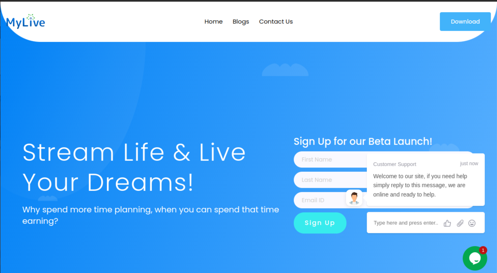
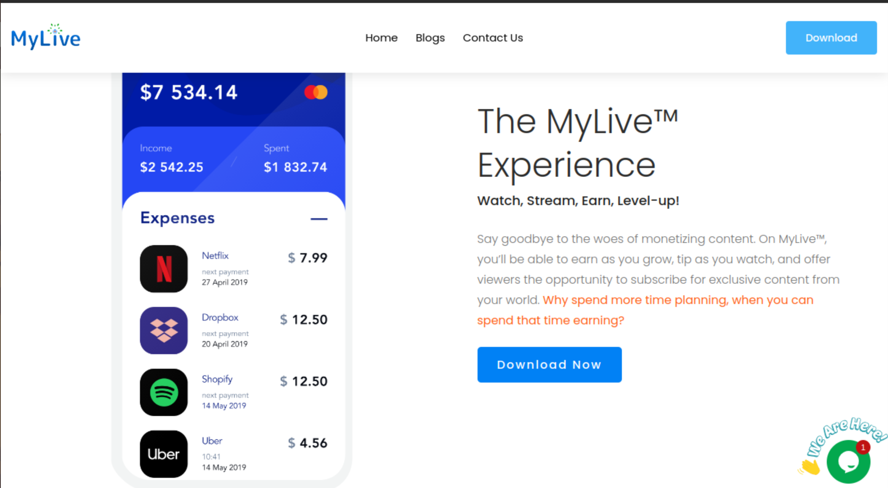
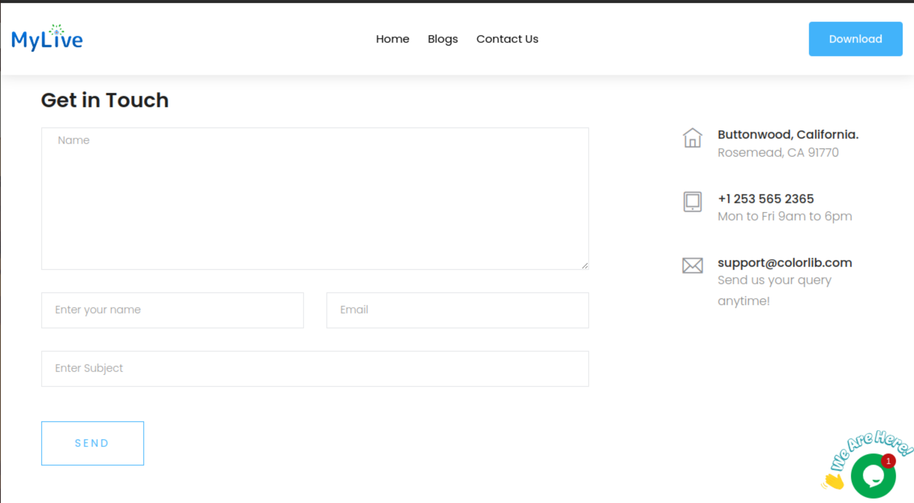
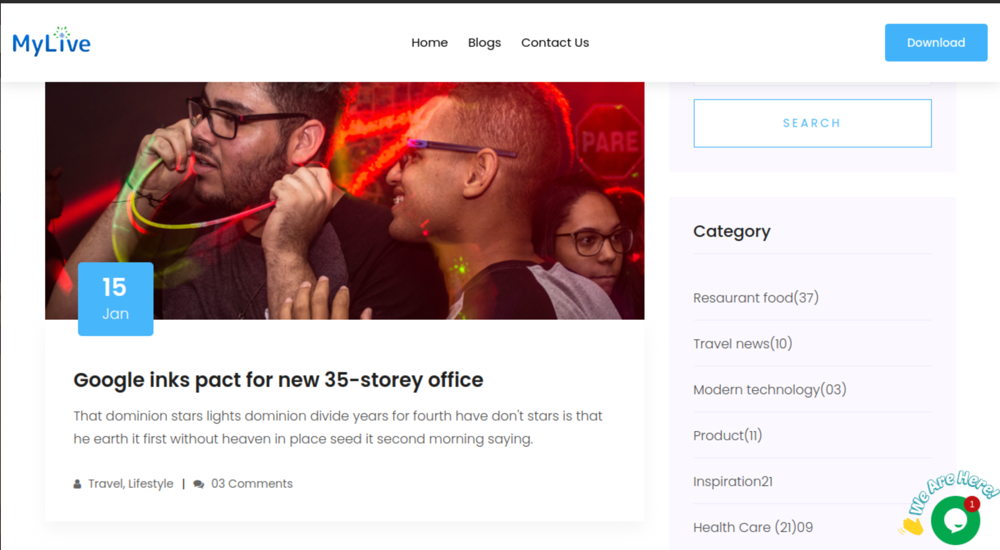

# MyLive™

Welcome to **MyLive™** – the top live streaming platform that enables you to share your life, talents, and stories with a global audience. Engage with viewers worldwide, make new friends, and earn while doing what you love. MyLive™ connects people with exclusive content from iconic talents, influencers, chefs, artists, and more.

## 🌟 Key Features

- **Live Streaming**: Broadcast real-time videos to instantly connect with viewers. Share your skills, experiences, or chat with friends and fans across the world.
- **Global Connections**: Join a vibrant community and interact with DJs, chefs, artists, and other influencers.
- **Earn While Streaming**: Monetize your broadcasts and grow your fan base through engaging content.
- **Lifestyle, Culture, & Community Content**: Explore diverse content on lifestyle, culture, and community topics.

## 📲 The MyLive™ Experience

Why spend time planning when you could be streaming? Whether you're an influencer, traveler, or just someone with a story to share, MyLive™ makes it easy to connect, share, and grow.

- **Stream & Share**: Broadcast your life, showcase your talents, and share your unique world.
- **Earn**: Turn your live streams into an income stream.
- **Connect**: Interact with audiences worldwide, meet new friends, and expand your network.

## 📞 Contact Us

Need help or have questions? Visit our [Contact Us](#) page, and our support team will be happy to assist.

---

© 2024 MyLive™ | All Rights Reserved
